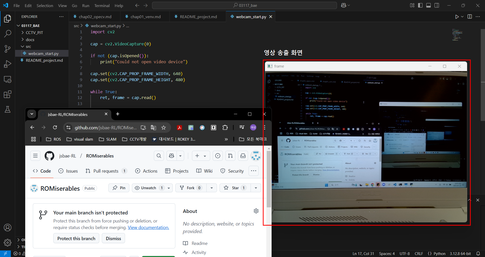

# CCTV 개발 프로젝트
## 목적
- 본 Rokey 커리큘럼내에 있는 딥러닝 맛보기

- 본 Rokey 커리큘럼내에 있는 OpenCV 맛보기
    - 딥러닝보다는 OpenCV사용에 조금 더 초점이 맞춰져 있음

## 절차(목차)
1. 가상환경 생성

2. opencv 라이브러리 설치
3. webcam 열기  
    - 강의를 위해 사용중인 webcam을 기준으로 제작
    - 만일 webcam 없다면, 사용할만한 영상 제공
4. webcam 영상 저장
5. 영상 내 도형 그리기 및 글자 입력(OpenCV 심화)
6. 딥러닝 알고리즘 사용을 위한 환경 설정(cuda 또는 필수 라이브러리 설치) (**중요**)
    - 본 프로젝트 담당자의 노트북을 성능을 기준으로 설치할 예정
    - 개인 노트북의 성능을 기준으로 설치할 것
7. webcam 영상에 딥러닝 알고리즘 적용
    - 본 프로젝트에서는 학습 및 알고리즘 설명을 제외
    - 간단한 설명만 추가 예정
8. tracking 알고리즘 적용
    - 딥러닝 알고리즘과 동일하게 간단한 정의만 설명 예정
9. people counting 알고리즘 적용

## 목차 및 내용
### [chapter 1 : 가상환경 생성](docs/chap01_venv.md)
### [chapter 2 : OpenCV 라이브러리 설치](docs/chap02_opecv.md)
### [chapter 3 : Webcam 열기](src/webcam_start.py)

### [chapter 4 : Webcam 영상 저장](src/webcam_add_save.py)
### 5. 이미지내 선 및 도형 그리기 및 글자 입력(OpenCV 심화)

### 6. 딥러닝 알고리즘 사용을 위한 cuda 설치 및 환경 셋팅

### 7. webcam 영상에 딥러닝 알고리즘 적용

### 8. tracking 알고리즘 적용

### 9. people counting 알고리즘 적용

