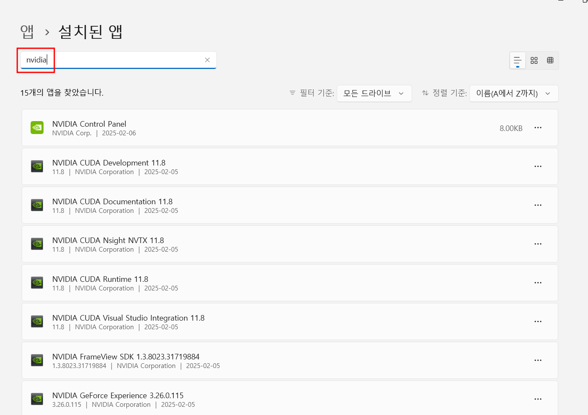
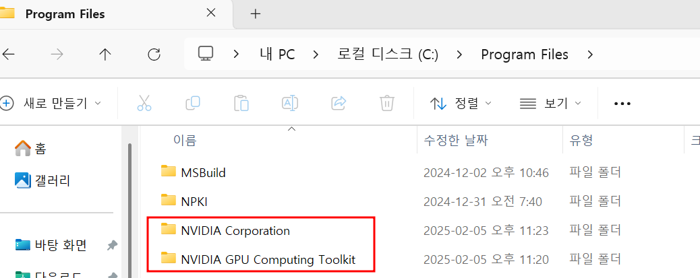

# Appendix 01 설치된 CUDA 삭제
- CUDA는 python라이브러리와의 버전 관계로 인해 삭제 및 재설치 되는 경우가 있습니다.
- 버전문제 뿐만 아니라 설치한지 기간이 오래된 cuda는 지우고 알맞는 버전으로 재설치를 권장하기도 합니다.
    - 하드웨어 성능이 좋아지면서, 최신 딥러닝 알고리즘 기술을 위하여 GPU 하드웨어 자체의 계산 방식이 달라지기 때문입니다.
- CUDA를 제거하는 방법은 굉장히 쉽습니다.

## 프로그램 삭제에서 NVIDIA 검색 및 삭제
- 윈도우 키를 눌러 "프로그램 추가/제거" 어플을 열어줍니다.
- 이후 검색 키에 nvidia를 검색하여 아래 이미지에 있는 어플들을 모두 삭제합니다.
    - 간혹가다 그래픽 드라이버는 안지워도 된다는 글들이 있었지만, 작성자의 경험상 모두 다 삭제하는 것을 권장합니다.
   <center></center>

## 잔여 파일 및 폴더 삭제
- 하기 3개의 폴더를 모두 삭제해줍니다. 이후, 다른 버전의 CUDA를 설치할때, 충돌을 방지 하기 위한 작업입니다.
    - ```C:/Program Files/NVIDIA Corporation```
    - ```C:/Program Files/NVIDIA GPU Computing Toolkit```
    - ```C:/Program Files (x86)/NVIDIA Corporation```
<p align="center">
    
    
</p>

