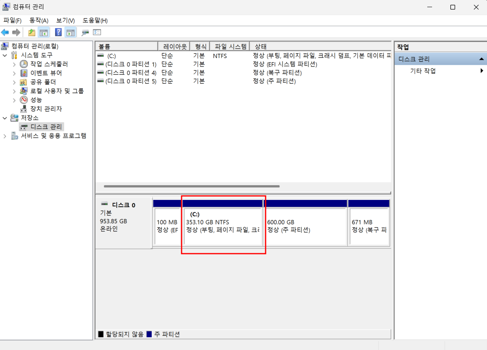
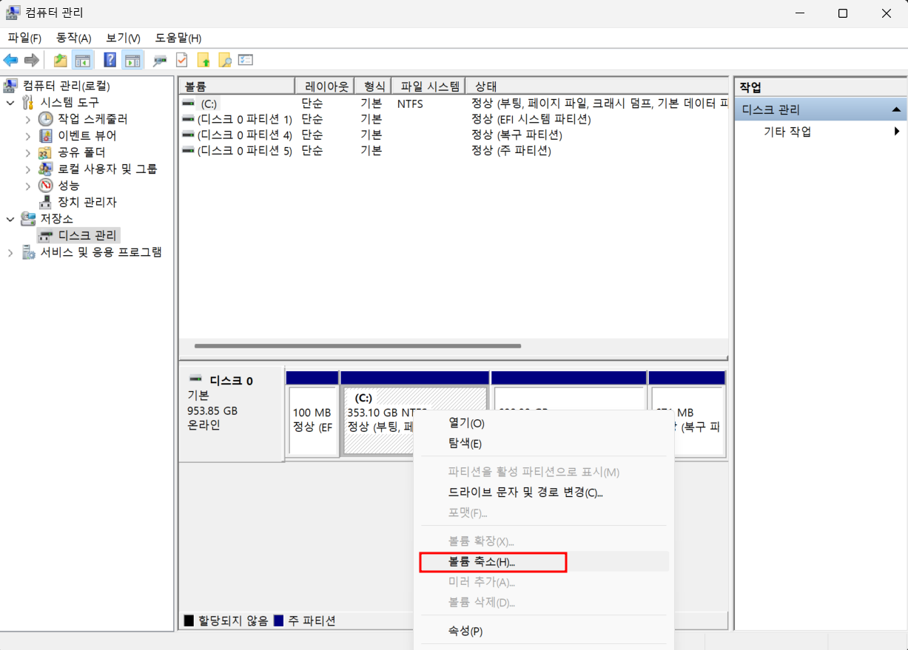
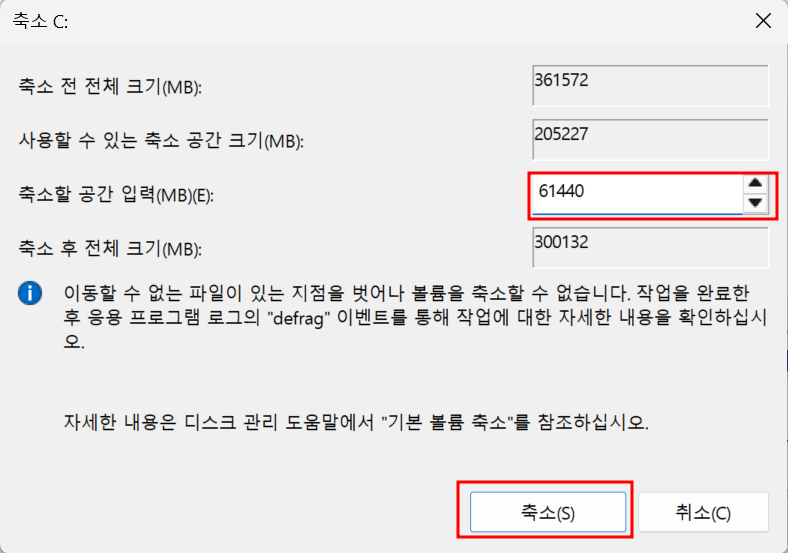
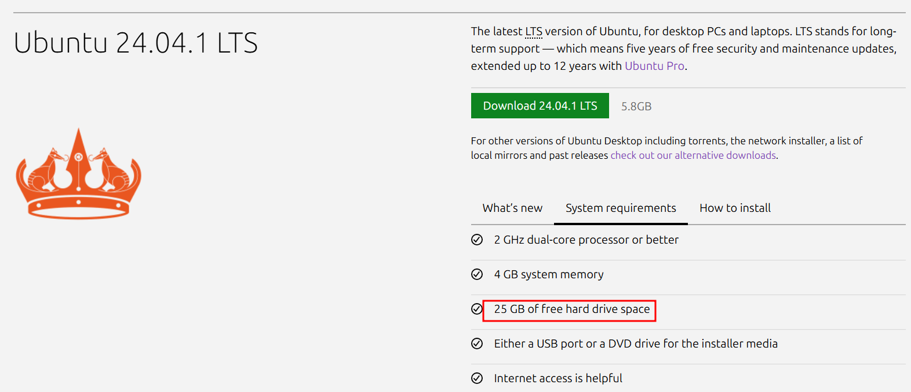
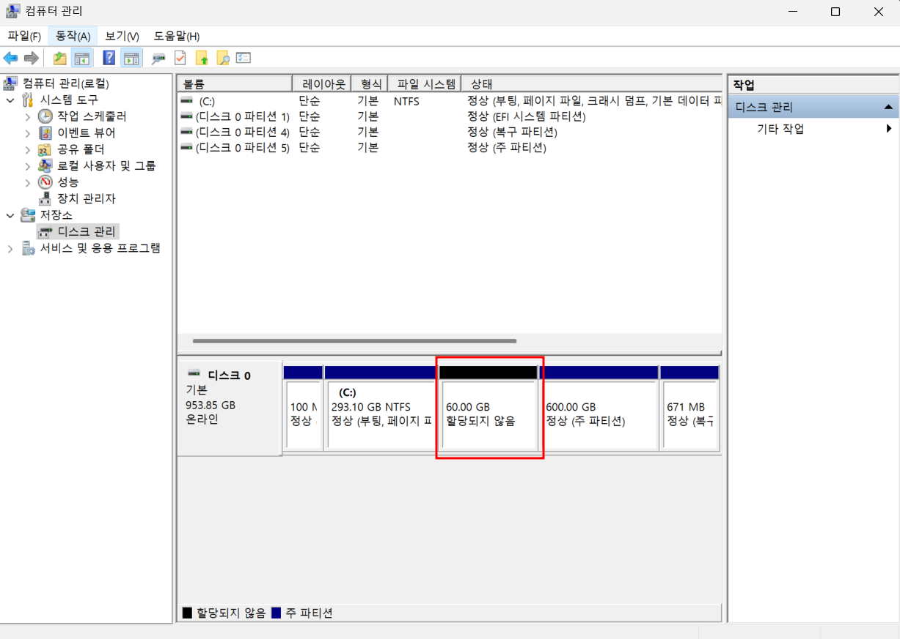
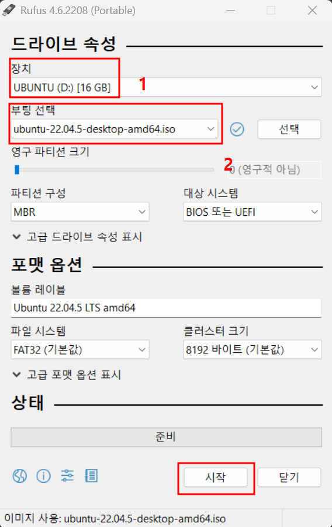

# Appendix 02 듀얼 OS 셋팅하는 법
- 대부분은 개발자는 linux를 사용하고 있지만, 피치 못할 사정으로 인해 window를 설치하는 경우가 많습니다.
- 많은 사람들이 window에 WSL이라는 가상환경을 설치하여 ubuntu를 사용하거나, Oracle VirtualBox를 사용하는 경우가 많습니다.
- 하지만, 이러한 방식을 권장하지는 않습니다.**(작성자의 지극히 개인적 의견)**
    1. WSL은 똑같은 ubuntu환경이지만, window 시스템의 하위 프로그램으로써 제약이 많습니다.
        - docker와의 연동 문제
        - jetson nano 와 같은 edge device와의 연동 등
    2. VirtualBox는 가상환경입니다.
        - 실제 PC와의 통신의 어려움
        - USB연결을 위한 추가 소프트웨어 또는 명령어 입력 등
- 이를 해결하기 위해 듀얼 OS를 사용하는것을 권장하고 현재 작성자도 듀얼 OS를 사용중에 있습니다.
## 0. 준비물
- **window os가 설치되어있는 PC**
- **적당한 SSD용량을 가지고 있는 PC**
    - PC의 용량이 부족하다면, 외장 SSD에 ubuntu를 설치하는것도 가능합니다.(해보지는 않았지만, 사용하는 사람을 본적은 있음)
- **Ubuntu 설치 USB**
    - USB를 만들줄 모르신다면, 가장 아래 ubuntu usb 만드는 법을 참고 부탁드립니다.

## 1. Window 환경에서 Partition 분리
- 지금부터는 꼭 필요한 설명을 제외하고 화살표만으로 기술하겠습니다.
- 파일 탐색기 좌측에서 **내 PC**에서 **우클릭** -> **관리**(윈도우 11 유저는 **추가 옵션 표시**를 먼저 클릭) -> 왼쪽 베너에서 **디스트 관리** 클릭
- C드라이버를 선택 및 우클릭 -> 축소 -> 축소할 공간 작성 -> 축소 완료
    - 파티션 축소시 유의 사항***(아래 이미지는 예시 입니다.)***:
        1. **1GB = 1,024MB**로 계산, ex) 60GB의 용량을 가지는 파티션 생성을 위해, 축소할 공간에 61440를 입력(1024 * 60)   
        2. (참고사항 : ubuntu공식홈페이지에서 ubuntu 설치 용량이 25GB이기때문에, ROS의 공간을 위해 넉넉하게 축소)

    
    
    
    
    <figcaption align="center">좌상단 -> 우상단 -> 좌하단 -> 우하단 순서</figcaption>

 

## 2. ubuntu 설치
- ubuntu 설치 usb 삽입 -> 바이오스 진입(PC의 기종마다 다르지만, 일반적으로 del, F2, F12 셋중 하나) -> boot priority에서 usb를 가장 처음으로 셋팅 -> F10(저장 및 exit)
- Install Ubuntu -> 키보드 레이아웃 **중요!!! 무조건 영어** -> 다음(일반 설치, ubuntu 설치중 업데이트 등등 기본 값 고정) ->  설치 형식 **중요!!! Something else 선택** -> **free space(아까 만들어 놓은 용량을 기억 해야합니다.)**에서 우클릭 -> add 클릭 -> Create partition항목은 아래를 참고 해주세요.
- Create partition 설정 항목
    - size = 내가 설정한 크기가 맞는지 확인
    - Type for the new parition = Primary
    - Location for the new partition = Beginning of this space
    - Use as = Ext4 journaling file system
    - Mount point = /   (슬래시 하나만 입력하시면 됩니다.)
- install Now 클릭 -> write the changes to dist? 하고 알림창이 뜬다. = continue -> 국적 선택(지도에서 대한민국 찾아서 클릭) -> 컴퓨터 이름 및 비밀번호 설정 -> 설치중 ... -> Restart Now -> USB뽑고 재부팅

### 끝!!!!
- 아직 ubuntu 포맷을 하지 못하여, 이미지는 올리지 못했습니다.
- 차주 파이썬평가가 완료되고나서 ubuntu 포멧 및 재설치를 할 예정입니다. 그때 이미지를 추가해서 다시 push 하도록 하겠습니다.

## Ubuntu 부팅 usb 만들기
0. 준비물 : 아무것도 없는 빈 usb
    - ubuntu설치용 usb로 바뀔때, 자동 포맷됩니다.
    - 공식홈페이지에서는 2GB이상 usb를 사용 하라고 하지만, 12GB정도가 가장 안전합니다.
1. 아래 링크에서 ubuntu 22.04 desktop파일을 다운로드(64-bit (AMD64) desktop image 클릭)
    - https://releases.ubuntu.com/22.04/?_ga=2.46316263.1337177100.1738853550-602322312.1737794673&_gl=1*1nfxld5*_gcl_au*MTY0NDkyNTA4Ny4xNzM3Nzk0Njc0 
2. 아래 링크에서 ubuntu 설치 usb를 만들기 위한 rufus다운로드 (window x64 : 64비트중 아무거나 받으시면 됩니다.)
    - https://rufus.ie/ko/ 
3. 1과 2가 설치가 완료되었다면 usb장착후 rufus 실행
4. 선택 -> 1번에서 다운로드 받은 ubuntu.iso파일 선택 후 열기
5. 시작 버튼 클릭(다른거는 기본값으로 놔두시면됩니다.)
6. ISO 이미지 모드로 쓰기(권장) 을 체크하고 OK (아마 기본값이기때문에 그냥 OK누르시면 됩니다.)

### 끝!! 이제 사용