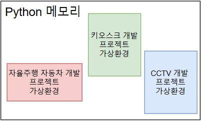
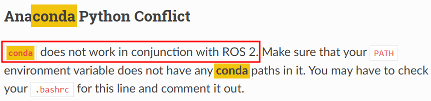
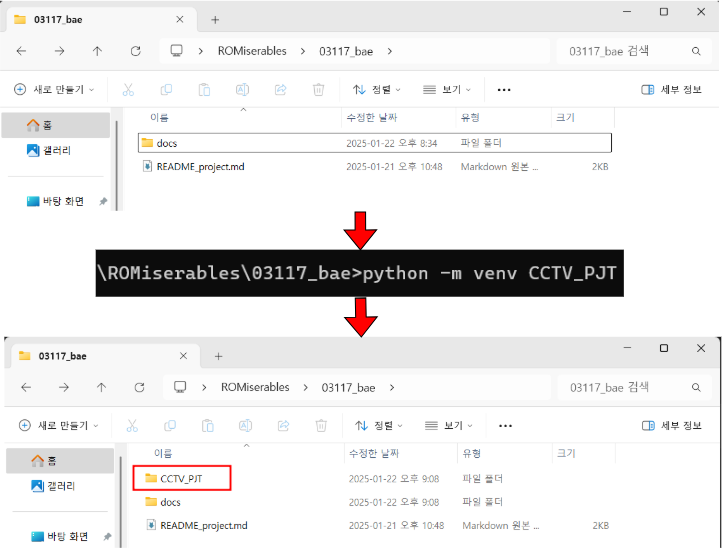
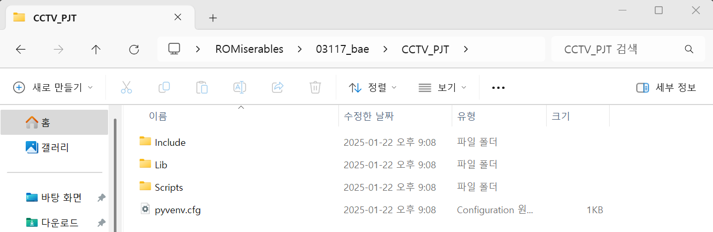
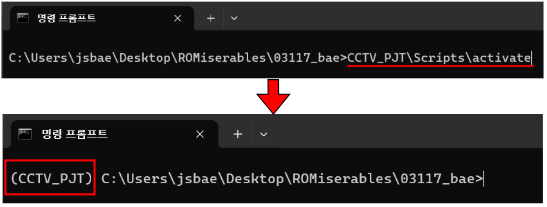

# 1. 가상환경 생성
- 본 프로젝트는 가상환경을 제작하여 각 라이브러리의 버전 관리


## python의 단점
- python은 **무료이며, 사용이 쉬워 개발 속도가 빠르다**는 등의 장점있다.

- 하지만, 프로젝트를 진행하다보면 **다양한 사용자 정의 라이브러리(모듈)들을 설치**하게 된다.
    - 이러한 방법으로 인해 python이 객체지향언어라 정의할 수 있다.
- python의 큰 단점 중, 하나는 각 설치된 **라이브러리의 버전에 민감**하다. 즉, 버전이 달라지면 개발된 프로그램이 구동하지 않을 수 있다.
    - 이를 **의존성(dependency)** 이라 한다.


## 가상환경의 정의 및 특징
- 가상환경은 이러한 **라이브러리의 의존성을 관리**하기 위해 **독립된 환경**을 제공하는 시스템이다.

    - 이를 그림으로 표현하면 아래와 같다.

      

### 가상환경의 특장점
-  **독립된 환경**
    - 가상환경은 독립적으로 하나의 프로젝트에서 사용하는 패키지나 라이브러리가 다른 프로젝트에 영향을 미치지 않는다.
-  **다양한 종적성 관리**
    - 프로젝트마다 필요한 패키지와 그 version을 별도로 설치 및 관리할 수 있다.

### 가상환경의 종류
- 가장 많이 사용되는 가상환경 관리도구는 pipenv, venv, conda가 있다.
- 본 프로젝트는 가장 간단하면서 사용하기 쉬운 venv를 사용한다.
- Conda를 빼고 아무거나 사용해도 좋다.
    - Conda는 ROS2와 사용하면 충돌을 일으킨다는 내용이 공식문서에 담겨있다.
    
    - ROS2 공식문서 링크 : https://docs.ros.org/en/humble/How-To-Guides/Installation-Troubleshooting.html 
#### 1. pipenv
- 파이썬에서 공식적으로 권장하는 관리 도구이다.
    - **Dependency Graph 시각화 기능**을 통하여 라이브리러의 정확한 버전 관리를 수 있다.
#### 2. venv
- 파이썬 3.3 버전 이상에서 기본적으로 제공되는 가상환경 생성 도구
    - 별도의 도구를 설치할 필요없이 바로 사용 가능, 간단하고 쉬운 사용법을 가지고 있다.
#### 3. conda
- Anaconda라는 프로그램의 배포판에 포함된, 가상환경 관리도구
    - 여러 언어를 지원한다.


## 가상환경 사용법
### 1. 가상 환경 생성
- 명령 프롬프트를 열어 생성하고자 하는 디렉토리로 이동하여 아래의 명령어를 실행
```bash
python -m venv "가상환경 이름"
```


- 가상환경 이름 / Includ, Lib, Scripts 폴더 및 pyvenv가 생성되면, 가상환경의 생성이 완료


### 2. 가상 환경 활성화
- 활성화는 가상환경을 켠다는 의미이며, 가상환경을 켜야 사용이 가능하다
```bash
'가상환경이름'/Scripts/activate
```
- 아래의 이미지와 같이 명령프롬프트가장 앞쪽에 가상환경의 이름이 올라와있으면, 활성화가 완료되었다.


### 3. 가상 환경 비활성화
- 가상환경에서 빠져나가기 위한 명령어이다
- 명령프롬프트 가장 앞쪽의 환경 이름이 없어진다.
```bash
deactivate
```

### 4. 사용자 정의 라이브러리 설치
- pip를 활용하여 설치
    - pip는 2. opencv 라이브러리 설치에서 추가 설명
```bash
pip install '사용자 정의 라이브러리 이름'
```