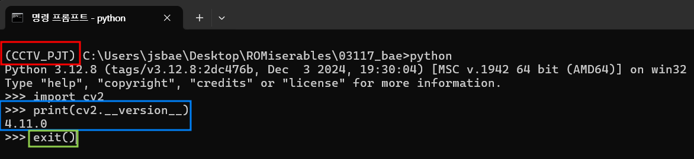

# 2. OpenCV 라이브러리 설치
- OpenCV를 사용하기전 라이브러리 설치 및 관련 내용을 기술
- 가상환경을 activation(활성화)를 한 상태에서 진행한다.

## OpenCV
- OpenCV는 Open Source Computer Vision의 약자이다.
- 영상 처리에 사용할 수 있는 오픈 소스 라이브러리이며, 광범위하게 사용된다.
    - 오픈소스 : user(개발자(사람))가 개발하여 무료로 누구나 사용할 수 있도록 배포한 코드
- 대표적으로 사용 언어는 C++/python
- 딥러닝의 이미지 처리에서 필수적으로 사용되는 라이브러리


## 라이브러리 설치법
```bash
pip install '라이브러리 이름'
```
- 그럼, OpenCV 라이브러리는 아래와 같이 설치할 수 있다.
- 가상환경을 활성화한 상태에서 실행해야한다.
```bash
pip install opencv-python
```
- pip를 활용하여 설치 제거 가능하다.

### 설치 확인
- 명령 프롬프트에 python이라 타이핑하면 python IDLE이 실행된다.
    - 일반 vscode를 실행하여 진행하여도 괜찮다. 단지, vscode를 켜고 끄기 번거롭기 때문에 바로 확인할 수 있는 방법이다.

```cmd
python
```
- 아래의 명령어를 순차적으로 입력하여 결과를 확인한다.
```cmd
>>> import cv2
>>> print(cv2.__version__)
4.11.0 # 이와같은 version이 뜨면 잘 설치가 된 것
>>> exit() # IDLE를 빠져 나올 수 있다.
```



## pip
- python으로 작성된 패키지 라이브러리를 관리해주는 시스템이다.
### 대표 명령어
- pip를 사용함에 있어 필수 명령어들을 알아본다.
#### 1. 패키지 설치
- pip install 명령어로 패키지 설치
- 이는 pypi에 있는 라이브러리를 설치
```bash
pip install <패키지명>          # 기본 설치
pip install <패키지명>==<버전>  # 버전 지정 설치 
# ex) pip install opencv
#     pip install opencv==4.8.0 
```
##### *pypi 란?
- pypi는 Python Package Index의 약어
- 파이썬 공식 저장소로 파이썬 사용자들이 사용자 지정 모듈(라이브러리)를 제작하여 **모든 사람들이 사용할 수 있도록 배포한 저장소**이다.
    - 즉, pip는 라이브러리를 관리해주는 시스템으로써 pypi에서 라이브러리를 다운받을수 있도록 하는 기능이 있다.
    - 따라서, **pip install 할때는 인터넷(와이파이 or 유선)연결**이 되어있어야 한다.
- github의 public repository와 비슷하다.
- pypi url : https://pypi.org/
- opencv-python pypi url : https://pypi.org/project/opencv-python/

#### 2. 패키지 제거
- pip uninstall 명령어로 설치되어있는 패키지를 삭제할 수 있다.
```bash
pip uninstall <패키지 명>
```

#### 3. 패키지 업그레이드
```bash
pip install --upgrade <패키지 명>
```

#### 4. 패키지 목록 조회
- 설치되어있는 패키지의 목록을 조회할 수 있다.
```bash
pip list
```

#### 5. 설치된 패키지 확인
- 설치된 패키지의 상세 정보(버전, 설치 위치 등)의 상세 정보를 확인할 수 있다.
```bash
pip show <패키지명>
```