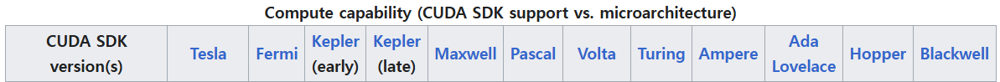

# 6. 딥러닝 알고리즘 사용을 위한 cuda 설치 및 환경 셋팅
- 본 챕터는 윈도우 기반의 설치방법을 기술합니다.
- 본 작성자의 PC는 RTX 3070이 탑재되어 있어, 이를 기준으로 기술합니다.
- 사전 준비사항 :
    1. nvidia사의 그래픽 카드가 탑재되어 있어야 합니다.
        - cuda는 nvidia사의 그래픽 카드의 계산 능력을 올려주는 개발 툴입니다. nvidia 그래픽 카드가 없는 경우, 활용할 수 없습니다.
            - nvidia 그래픽 카드가 없는 경우, 건너뛰셔도 됩니다.
            - Mac의 경우, 사용가능합니다. 하지만, 마찬가지고 nvidia gpu가 있어야 합니다.
    2. nvidia 홈페이지에 회원가입이 되어있어야합니다.
        - cuda 및 추후 언급되는 cudnn(CUDA Deep Neural Network)을 다운받을때 사용됩니다.
        - 요금은 발생하지 않습니다.

## 1) GPU와 CUDA의 호환성 확인
- nvidia gpu를 사용하더라도 모두 사용할 수 있는 것은 아닙니다.
- 따라서, 설치되어 있는 GPU가 CUDA를 사용하기에 적합한지 확인이 필요합니다.

### GPU 지원 정보 및 적절한 CUDA 정보 확인
1. 먼저, CUDA 정보가 기술되어있는 wikipedia에 접속합니다. (아래 링크를 확인부탁드립니다)
    - https://en.wikipedia.org/wiki/CUDA
<center></center>

2. 자신의 gpu를 검색하여 연산능력(Compute camability)을 확인합니다.
    - 만일, 노트북에 탑재 되어있는 경우, mobile 또는 labtop이라는 명칭이 뒤에 붙습니다. ( ex) RTX 3070 mobile )
    - 이 경우, wikipedia에 언급이 되어있지 않은 경우가 있습니다. 그 때는 아래의 링크를 참고하여 찾아주시됩니다.      
        - https://developer.nvidia.com/cuda-gpus
        - 작성자의 경험상 Ti를 빼고 Mobile이 붙은 것과 안붙은 것은 점수에서 크게 차이가 나지는 않았습니다. (RTX 3070 == RTX 3070 labtop)
    - Compute capability = 5 이하는 CUDA사용을 권장하지 않으며, 3.5이하는 사용이 불가합니다.
<center></center>

3. Compute capability항목에서 앞서 확인한 정보를 비교하여 cuda 버전을 확인한다.
    - 이 과정은 적절한 CUDA버전을 확인하기 위함입니다.
    - 초록색으로 색이 칠해져 있는 version은 설치가 가능한 버전입니다.
    - 하지만, 적절한 버전보다 높은 버전 또는 낮은 버전을 사용해도 가능합니다만, 온전한 하드웨어의 성능을 사용하기 위해서는 적절한 CUDA버전을 활용하는 것이 좋습니다.
        - 참고사항) 최근 딥러닝 기술이 발전하면서 10.0 미만의 cuda는 거의 사용되진 않습니다.
    - 본 PC에 탑재되어있는 GPU에 따르면 **CUDA버전은 11.1 ~ 11.4 버전**을 사용을 해야하나(검정색 표시), 차후 **딥러닝 및 cudnn의 지원을 위해 12.8버전**을 설치합니다.   
    (관련 내용을 뒤에 추가 언급이 있습니다.)
<center></center>

## 2) CUDA 설치
- 아래의 링크에 입장하여 위에서 확인된 버전 정보를 토대로 CUDA 설치 페이지로 입장합니다.   
https://developer.nvidia.com/cuda-toolkit-archive
<center></center>

- 아래의 그림과 같이 해당되는 옵션을 클릭후, download를 클릭합니다.
    - installer Type은 되도록 exe(local)을 선택하는 것이 좋습니다.
        - local = 설치를 위한 모든 파일을 exe형태로 제공
        - network = 필요한 파일만 제공하고 네트워크로 custom으로 설치가 가능
        - 따라서 cuda에 대해서 잘 모르는 개발자는 local로 설치하는 것이 오류발생을 줄일 수 있습니다. 
<center></center>

- exe파일을 다운받아 설치를 진행합니다.

- 설치가 완료되었습니다.

## 3) cudnn(CUDA Deep Neural Network) 다운로드 및 적용
- cudnn은 DNN(심층 신경망)을 위한 GPU에 액세스된 라이브러리 입니다.
- 신경망은 y = ax + b라는 식의 모음(행렬)이고, 이 식이 수천개에서 수만개를 계산해야하는 프로그램으로 GPU의 병렬처리가 필요합니다.
    - 이를 위해, gpu와 직접적으로 데이터를 주고 받을수 있는 cuda를 활용하여 데이터를 gpu로 넣고, gpu에서 행렬 계산이 특화되어있는 cudnn으로 계산속도를 높힐 수 있습니다.
- 본 글의 버전은 9.7.0버전을 활용하며, 사유는 아래와 같다.
    1. cuDNN의 공식 설명 문서에 GPU Volta 이상 권장 구성은 CUDA 12.8, cuDNN 9.7.0라고 기재되어있었습니다. - 12.8 버전을 선정한 사유
        - 이 버전의 조합이 최상의 성능을 낼수 있다고 합니다.
    2. 11.8 버전 이하는 정적 linking을 사용할 수 없다. - cuda 버전을 11.8이상인 버전을 선정한 사유
    2. RNN을 제대로 활용하려면, 11.5이상의 cuda가 있어야한다고, 공식 문서에 설명되어 있습니다. - 11.5 이하버전을 고려하지 않은 이유

1. 먼저, cuda를 설치했던것 처럼 하단의 링크로 이동하여, option을 선택한 후, download합니다.
    - https://developer.nvidia.com/cudnn-downloads
<center></center>
<center></center>

2. 다운받은 cudnn 압축폴더의 압축을 풉니다.

3. 폴더 2개를 열어 하나는 CUDA경로에, 또 하나는 cudnn압축을 푼 상태로 띄웁니다. 
    - 일반적으로 cuda설치 경로를 변경하지 않았다면, 다음과 같습니다. "C:\Program Files\NVIDIA GPU Computing Toolkit\CUDA\v12.8"
    - 아래와 같이 해당폴더 3개를 cuda 폴더에 붙여넣습니다.
    <center></center>

## 4) 환경변수 및 CUDA등록 확인하기
- 환경 변수는 프로세스가 어떠한 작업을 할 때 필요로 하는 정보를 손쉽게 접근/처리할 수 있도록 해주는 것입니다.
- 예전에는 CUDA를 설치하면 사용자(개발자)가 직접 환경변수를 추가하였는데, 변경되어 자동으로 등록이 될것입니다.
- 하지만, 등록되어있지 않다면 아래 내용을 따라하며, 등록해주시면 됩니다.

1. 시스템 환경 변수 편집을 구동합니다.
    <center></center>

2. 고급 탭에서 환경변수를 클릭합니다.
<center></center>

3. 환경변수가 잘 들어가 있는지 확인합니다.
<center></center>

4. 만약 등록되어 있지 않다면 아래의 이미지와 같이 추가 하시면됩니다. 
<center></center><center></center>

5. 최종적으로 CUDA가 잘 설치되었는지 확인합니다.
    - 명령 프롬프틑 열어 아래 명령어를 치고 결과가 나오면 설치가 잘된것입니다.
    ```nvcc --version ```, ```nvidia-smi```
<center></center>