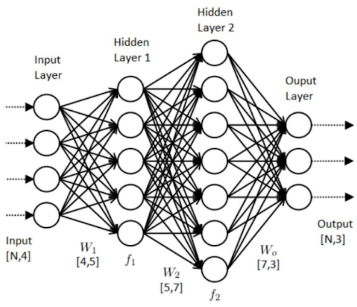

# 7. webcam 영상에 딥러닝 알고리즘 적용
- 본 챕터에서 딥러닝 알고리즘의 결과를 영상으로 출력합니다.
- 활용하는 알고리즘은 yolov11이다. 본 알고리즘의 선정 이유는 아래와 같습니다.
    1. 작성자가 아는 한 **가장 최근인 24년 10월에 public**된 알고리즘으로 정확도 및 실시간성이 보장되어있는 알고리즘이기 때문입니다.
    2. 이미 학습되어 있는 가중치를 제공하며, 딥러닝에 대해 알지 못하여도 활용할 수 있을만큼, **쉽게 public** 되어있기 때문입니다.
        - 본 문서는 딥러닝에 대한 지식의 전달이 목적이 아닌, 딥러닝을 활용한 프로젝트를 개발할때, 필요한 요소들을 전달하기 위해 작성하였기 때문입니다.
        - 딥러닝은 CCTV를 개발함에 있어 하나의 요소기술에 지나지 않기 때문입니다.
- 알고리즘에 대해 설명하지는 않습니다.

## 1) 딥러닝이란?
- 딥러닝에 대하여 지식 전달이 목적이 아니라 하였지만, 간단하게 어떤것인지는 언급할 필요가 있을 것 같습니다.
- 딥러닝은 인공신경망이라는 기법을 활용한 머신러닝의 하나의 방법입니다.   
<center><figcaption>AI vs Machine Learning vs Deep learning</figcaption></center>

<center><figcaption>ANN (Artificial Neural Network)</figcaption></center>

## 2) Deep learning for Computer Vision
- Computer Vision = 컴퓨터가 이미지(or 영상)와 같은 시각적인 데이터를 분석, 또는 정보 추출을 하는 분야

### DL based Computer Vision 
1. classification(분류) vs object detection(탐지) vs segmentation(분할)
<center><figcaption>Computer Vision 1</figcaption></center>
2. human pose estimation
<center><figcaption>Computer Vision 2</figcaption></center>
3. image enhancement
<center><figcaption>Computer Vision 3</figcaption></center>
4. image enhancement
<center><figcaption>Computer Vision 4</figcaption></center>

### Object Detection
- 이미지 내에서 객체의 분류와 위치를 동시에 찾는 알고리즘입니다.
- 위에서 언급드렸다 시피 본 문서에서는 최신 알고리즘인 yolov11알고리즘을 활용할 것입니다.
- yolov11은 ultralytics라는 곳에서 개발하였으며 개발자들이 pypi를 통해서 배포되어 있기 때문에 pip install을 통해서 쉽게 설치 및 사용 가능합니다.   
```pip install ultralytics```
- 대부분의 필요한 라이브러리들은 ultralytics를 설치하면서 설치가 되지만, gpu를 사용하기 위한 pytorch는 따로 설치를 해주어야 합니다.
    - 그래야만, 제대로된 gpu를 사용할수 있습니다.
- pytorch는 딥러닝 프레임워크를 활용하는 라이브러리 중, 하나로 대표적으로 사용되는 프레임 워크입니다.
- 설치 순서는 다음과 같습니다.
    1. 파이토치 공식 홈페이지 진입 : https://pytorch.org/get-started/locally/
    2. 그림과 같이 본인의 pc에 맞는 옵션들을 선택, run this command에 나와있는 커맨드를 명령 프롬프트에 입력하여 설치하면 됩니다.
    <center></center>
    3. 만약 이전 버전 설치를 원하실 경우 아래의 사이트로 이동하여 설치된 항목에 맞게 설치하시면됩니다.
        - https://pytorch.org/get-started/previous-versions/
    4. torch 설치 후, 명령 프롬프트 -> ```python``` -> ```import torch``` -> ```torch.cuda.is_available()``` 을 확인하여 결과가 True가 나오지는 확인하면 준비가 완료되었습니다.