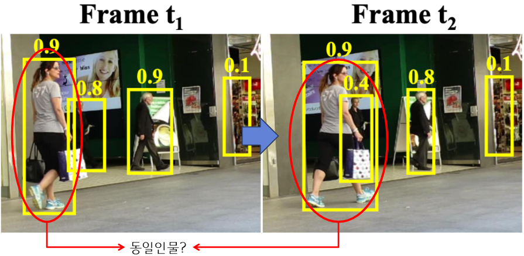

# 8. tracking 알고리즘 적용
- 본 챕터에서는 이전 object dection 이후 작업중에 하나인 object tracking을 확인합니다.
- 활용하는 알고리즘은 Bytetrack입니다.
    - 원래는 Bytetrack 알고리즘을 직접 설치하고 설치된 알고리즘을 적용해보려고 하였으나, 설치 과정이 복잡하여, yolov11개발자 들이 개발해놓은 코드를 활용하도록 하겠습니다.

## 1) tracking(object tracking) 이란?
- 비디오 또는 스트리밍 형태와 같이 프레임들이 연속해서 주어질 때, 물체를 추적(track)하는 것입니다.
    - 기본적으로 사람은 눈으로 볼때, 앞에 지나가는 사람이 있으면, 계속 똑같은 사람이 지나가고 있다고 인식할 수 있지만,
    - 카메라는 한개의 프레임에서 사람을 탐지하면, 그 다음 프레임이 들어왔을때, 동일한 객체 인지 인식을 못합니다.
- 아래 이미지를 보고 다시 말씀드리겠습니다.
    - frame t1 = t1번째 시간의 frame, frame t2 = t1번째 시간의 frame  (t1 < t2)
    - 사람은 육안으로 확인했을때, 빨간색 동그라미의 사람이 **회색 상의, 검정색 하의, 묶은 머리 등의 정보를 가지고 동일인물임을 판단**
    - 하지만, 카메라는 0~255 * 3의 픽셀 정보밖에 없기 때문에 이를 어떻게 분석하는지 방법을 모르면 동일인임을 판단하지 못합니다.
    
- 따라서, 카메라가 본 객체가 동일한지 안한지 판단하는 알고리즘이 tracking알고리즘입니다.

## 2) tracking 알고리즘의 활용 이유
- 그럼 왜 tracking 알고리즘을 활용해야 할까요?
1. 자율주행 자동차를 예를 들어 보겠습니다.
    - 상황 : 자율주행 자동차는 도로를 주행 중, 앞에서 보행자가 걸어오는 중이라 가정
        - 위 상황에서 자동차는 최대한, 보행자를 피하면서 주행을 해야합니다.
        - 자동차에게 필요한 기본적인 정보는? : 1. 사람인지 아닌지?, 2. 그 사람이 앞으로 어디로 갈 것인지?
        - tracking을 하면 보행자가 어디에서부터 온지 알 수 있을 것이며, 보행자가 온 경로를 토대로 앞으로의 경로를 예측 가능
2. PTZ(pan-tilt-zoom) CCTV의 기능을 통해 예를 들어보겠습니다.
    - 위험구역으로 접근하는 사람을 탐지한다고 가정
        - 접근중인 사람 지속적으로 위험구역으로 접근하는지 안하는지, 실시간 추척하며 감시
3. 하나의 객체에서 여러개의 bounding box가 탐지되었을때, 그 박스를 filtering 작업도 가능합니다.
   
- 위와 같은 상황들로 인해 tracking은 거의 필수 알고리즘이라 할 수 있습니다.

## 3) tracking 방식
- 그렇다고 한다면, 어떤식으로 동일인물인지 판단을 하는가?
- 객체에 id를 부여하는 방식으로 동일인물임을 판단합니다.
- 활용하는 bytetrack의 작동 방식을 간단하게 요악하도록 하겠습니다.
    1. t1시간에서의 탐지된 물체에 id를 부여한다.
        - 만약 이미지 안에 탐지된 객체가 많다면, 적절한 방법으로 id를 부여한다. (예를들어, x좌표가 작은 순서대로 0,1,2, ...으로 부여)
    2. t1시간의 bounding box좌표로부터 t2시간의 bounding box의 위치를 예측한다.
    3. 예측된 bounding box와 t2 시간의 탐지된 bounding box의 넓이 비율을 계산한다. (교집합/합집합)
    4. 일정 비율 이상 겹친다면 t2시간의 객체도 t1시간의 id와 동일한 id를 부여한다.


### 추가 bytetrack 설치 방법
1. install bytetrack - 아래 명령어 한줄씩 입력   

```bash
git clone https://github.com/ifzhang/ByteTrack.git   
cd ByteTrack   
pip3 install -r requirements.txt   
python3 setup.py develop
```

2. install pycocotools   

```bash
pip3 install cython; pip3 install 'git+https://github.com/cocodataset/cocoapi.git#subdirectory=PythonAPI'
```

3. cpython_bbox install
    - cpython_bbox는 window에서 설치할 경우 ```pip install cpython-box```로 설치가 불가능합니다.
    - 따라서, 아래 명령어를 순서대로 입력 바랍니다.
    - 주의사항 : 설치방법 1에서 ``` cd ByteTrack ```까지는 실행된 상태여야 합니다. 

    ```bash
    git clone https://github.com/samson-wang/cython_bbox
    cd cython_bbox
    pip install -e ./ 
    ```