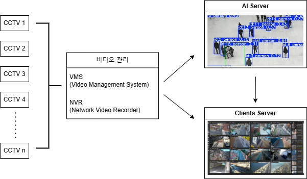
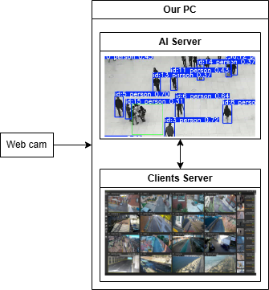

# 10. 개발된 cctv 프로젝트 배포를 위한 API 작성
- 본 프로젝트에서는 python의 API 라이브러리중 FastAPI를 활용합니다.
    - 가장 대중적으로 사용되고 있는 python api 라이브러리는 Flask와 Django가 있습니다.
    - Flask는 가벼운 웹개발에 사용하였고, 무거운 웹개발이면 Django를 대중적으로 사용했었는데, 이 두가지의 장점을 다 가지고 있다고 시장에 치고들어온게, FastAPI입니다.
       (필자는 Flask와 FastAPI를 많이 사용했습니다. Django는 너무 웹개발이라는 느낌이라 사용해 보지 못했습니다. 않았었습니다.)
- 라이브러리 공식 홈페이지 : https://fastapi.tiangolo.com/ko/ 
- 라이브러리 설치 : fastapi와 unicorn
    ```bash
    pip install fastapi[all]
    ```

## API란?
- API(Application Programming Interface)는 **컴퓨터와 컴퓨터 사이의 연결**을 의미하며, 일종의 소프트웨어 인터페이스입니다.
    - 컴퓨터와 사람사이의 연결을 의미하는 UI(User Interface)와는 다른 개념입니다.
- 그럼 **컴퓨터와 컴퓨터 사이의 연결**의 의미가 무엇인가? 여기서 필자는 **연결**을 **데이터의 정의**와 동일하다고 생각합니다.
    - 예를 들어, IP CAMERA와 컴퓨터 사이에 연결을 생각해보겠습니다.
        - IP CAMERA는 IP와 PORT 번호로 컴퓨터와 통신을 할 수 있게 됩니다.
        - 그럼 CAMERA와 컴퓨터를 연결하면, 실시간 영상이 컴퓨터로 데이터가 입력이 됩니다.
        - 이 뜻은, 카메라는 **'컴퓨터로부터 호출받으면, 영상이라는 데이터를 컴퓨터로 보내준다'**라는 의미가 됩니다.
        - 즉, 카메라는 호출받았을때, **통신하는 데이터가 영상으로 정의**되어있다.
- 즉, **API를 적용한다는 것은, 호출되어있을때 전송해야하는 데이터를 정의한다.**라고 볼수있습니다.
- 간단한 예제 : [간단한 API 구현](../src/chap10_example.py)

## API 시스템
### case 1 (일반적인 시스템)
- 일반적인 CCTV시스템은 아래의 그림과 같이 NVR(또는 VMS), AI server, client server가 모두 나눠져있습니다.

- 다만, 현재 하드웨어 또는 기타 환경적인 문제 때문에 아래 case2로 구현합니다.
- 컴퓨터간 통신을 위해서는 직/간접적으로 연결이 되어있어야 합니다.
    - 직접적인 방식 : 서로의 컴퓨터가 렌선으로 연결되어 있는 방식을 말합니다.
        - 이때는 "windows Defender 방화벽"을 통해 인바운드 규칙 및 아웃바운드 규칙을 port번호로써 열어주어야합니다.
    - 간접적인 방식 : 블루투스 및 와이파이을 통해 연결되어 있어야합니다.
        - 이는 단순 IP및 Port번호로 연결이 가능합니다.
        - 단, 같은 와이파이에 접속되어 있어야합니다.
    - (직/간접적이라는 명칭은 필자가 정의한것입니다. 따라서, 본래의 개념과 다를수 있습니다.)

### case 2 (our project)
- 우리는 컴퓨터를 다수 연결할수 없기 때문에, 아래의 이미지와 같이 하나의 PC에서 server 및 clients를 모두 구성합니다.

- 우리는 간적접인 방식을 사용하는 개념으로 활용될것이며, 내부 통신만 구현합니다.


## API 구현 종류
- SOAP API, REST API, GraphQL 등이 있습니다.
- 필자는 REST API밖에 몰라서 나머지는 넘어가겠습니다. 단, 그중 GraphQL은 REST API의 대안으로 Facebook에서 개발된 것으로 알고있습니다.

## REST API란?
- REST(Representational State Transfer)의 약자로 자원을 이름으로 구분하여 해당 자원의 상태를 주고받는 것을 의미합니다.
    - 즉, HTTP URL를 통해 자원(Resource)를 명시, HTTP Method(POST, GET, PUT, DELETE 등)을 통해, 해당 자원(URL)에 대한 CRUD Operation을 적용하는 것을 의미합니다.
- 그렇다면, CRUD Operation이란? 컴퓨터 소프트웨어가 가지는 기본적인 데이터 처리기능을 통합하여 부르는 말입니다.
    - 기본적인 데이터 처리란? Create(생성), Read(읽기), Update(갱신), Delete(삭제)를 말합니다.
    - 그렇다면, CRUD와 REST를 묶으면 아래와 같습니다.
        1. Create : 데이터 생성(POST)
        2. Read : 데이터 읽기(GET)
        3. Update : 데이터 수정(PUT)
        4. Delete : 데이터 삭제(DELETE)

- 위와 같은 REST의 원리를 따르는 API를 REST API라 합니다.

- 구현 코드는 [server.py](../src/final_CCTV/server.py), [template.html](../src/final_CCTV/templates/index.html)을 참고 부탁드리빈다.

<br />
<br />
<br />
<br />

## 위에 내용이 완전히 이해가 가신다면, 읽어보는 것을 추천드립니다.
## REST API의 특징
#### REST 구성 요소
- REST는 다음과 같은 3가지로 구성이 되어있다. 
    - 자원(Resource) : HTTP URI
    - 자원에 대한 행위(Verb) : HTTP Method
    - 자원에 대한 행위의 내용 (Representations) : HTTP Message Pay Load
#### REST의 특징
- Server-Client(서버-클라이언트 구조)
- Stateless(무상태)
- Cacheable(캐시 처리 가능)
- Layered System(계층화)
- Uniform Interface(인터페이스 일관성)
#### REST의 장단점
- 장점
    - HTTP 프로토콜의 인프라를 그대로 사용하므로 REST API 사용을 위한 별도의 인프라를 구축할 필요가 없다.
    - HTTP 프로토콜의 표준을 최대한 활용하여 여러 추가적인 장점을 함께 가져갈 수 있게 해 준다.
    - HTTP 표준 프로토콜에 따르는 모든 플랫폼에서 사용이 가능하다.
    - Hypermedia API의 기본을 충실히 지키면서 범용성을 보장한다.
    - REST API 메시지가 의도하는 바를 명확하게 나타내므로 의도하는 바를 쉽게 파악할 수 있다.
    - 여러 가지 서비스 디자인에서 생길 수 있는 문제를 최소화한다.
    - 서버와 클라이언트의 역할을 명확하게 분리한다.

- 단점
    - 표준이 자체가 존재하지 않아 정의가 필요하다.
    - HTTP Method 형태가 제한적이다.
    - 브라우저를 통해 테스트할 일이 많은 서비스라면 쉽게 고칠 수 있는 URL보다 Header 정보의 값을 처리해야 하므로 전문성이 요구된다.
    - 구형 브라우저에서 호환이 되지 않아 지원해주지 못하는 동작이 많다.(익스폴로어)