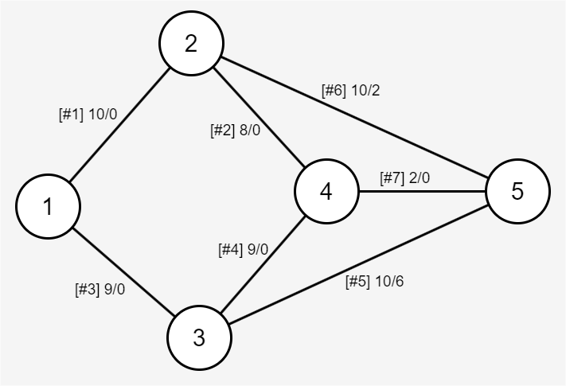
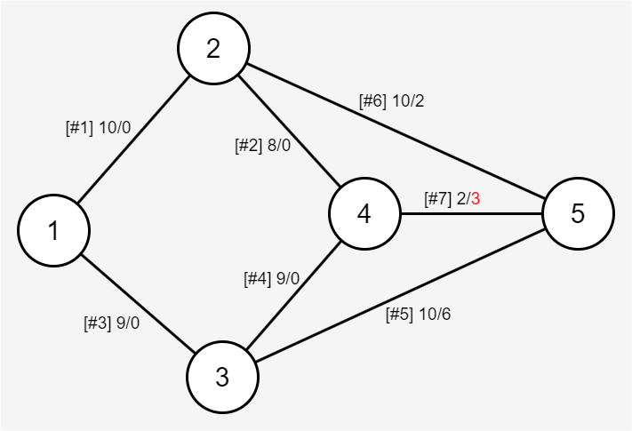

# 프로그래머스 코딩 테스트 : 중요한 도로 문제

- 작성자 : 제민수(ROKEY 3기생 DR-05131)
- 작성 기간 : 2025-01-18~(진행중)
- 버전 관리 : 1.2.1 ver
- 0.x 프로그램 실행 안됨 테스트 및 코딩 작성
- 1.1.x 프로그램 실행 됨(4가지 예시의 테스트 케이스는 통과 했으나, 제출시 시간초과 case가 많음.)
- 1.2.x 1.0ver의 문제점을 기타에서 code 수정에 대해 관리 할 예정
- 
## 📜목차

## [개요](#개요)
- [작성의 목적](#작성의-목적)
- [중요한 도로 문제의 목적](#중요한-도로-문제의-목적)
    
## [프로그램](#프로그램)
- [문제에서 사용할 변수 이름](#문제에서-사용할-변수-이름)
- [제한사항](#제한사항)
- [문제 요구사항 정리](#문제-요구사항-정리)
- [입출력 정리](#입출력-정리)

## [기타](#기타)

## 개요
 ### 작성의 목적
- ROKEY 3기 프로그램 진행에서 스터디 그룹에서 코딩 리뷰 및 학습 내용 공유를 위함.
- 스터디 피드백 내용 정리
  - 추가예정
- 해당 문서는 ROKEY 3기생 DR-03151제민수가 작성 하였으며, 문서 및 파일은 직접 수정하지 않는다.

 ### 중요한 도로 문제의 목적
- 도시의 이동 지점 및 차량 도로에 대한 정보를 이용하여 최단 경로를 찾으며, 도로의 트레픽 값이 하나 변경된다 가정 했을때 현재의 최단 경로가 변경 될때 영향을 주는 도로의 번호를 찾는 것이 목적이다.

## 프로그램

### 문제에서 사용할 변수 이름
- 도시 내의 n개의 지점 location_num
- 도로의 수 m road_num-> len(roads)으로 대체.
- *추가 roads(2차원 정수 배열)[[U1,V1,L1,T1],[U2,V2,2L,T2], ... ]
- 도로의 길이 L road_cost **roads의 최소 개수랑 나중에 이름이 헷깔릴거같아서 lenth 에서 cost로 수정 
- 교통량 t traffic

### 제한사항
- 2<= n <= 50,000
    - 1번 지점이 출발지, n번 지점이 목적지
- n-1<= roads의 길이 = m <=200,000
    - road[i] 는 i+1번 도로에 대한 정보를 담고 있으며 [U, V, L, T] 형태의 길이가 4인 1차원 정수 배열이다.
    - u번 지점, v번 지점을 연결하는 길이L, 교통량 T인 도로를 의미함
    - 1<=U<V<=n
    - 1<=L<=10^9
    - 0<=T<=10^9
    - 서로 다른 두 지점을 직접 연결하는 도로 는 최대 1개이다.
    -도로를 통해 한지점에서 다른 지점으로 이동하는 방법은 항상 존재한다.

### 문제 요구사항 정리
- 도시의 지점은 각각 숫자로 표기하며 항상 1번 지점이 출발지 n번 지점이 목적지 이다.
- 선분에 표기된 것은 [#도로 번호] 길이/교통량을 의미한다.

 - 목적지에 도착하기 까지 가장 빠른 예상 소요 시간은 1-2-4-5와 같이 이동 했을때 20 분이다.
 - 여기서 7번 도로의 교통 량이 3 증가 한다고 가정한 그림은 아래와 같다.
 
 목적지에 도착하기 까지 가장 빠른 소요 시간은 1-2-5로 이동하여 22이다.

 모든 도로의 교통량 정보를 실시간으로 업데이트 하는 것은 비효율 적이다. 한도로의 교통량이 변했을때 가장 빠른 예상 소요 시간이 변 할 수 있는 도로 (5,7)에 대해서만 실시간으로 교통량 정보를 업데이트 해햐 한다.

 지점의 수를 나타내는 정수 n과 도로의 정보를 나타내는 2차원 정수 배열 roads가 매개 변수로 주워 지며, 이때 한도로의 교통이 변했을때 1번 지점에서 출발해 n번 지점에 도착하는 가장 빠른 예상 소요 시간이 변 할 수 있는 도로의 번호를 오름차순으로 1차원 정수 배열에 담아 return 하도록 solution 함수를 완성하라.
 만약 그러한 도로가 없다면 -1을 리턴하라.
 
 ### 입출력 정리
 #### 입력
 - n(location_num) : 도시의 이동 지점 개수
 - roads(U(u_point),V(v_point),L(road_cost),T(traffic)) : 이동할 도로의 정보
 - U : U 지점
 - V : V 지점
 - L : 도로 이동에 걸리는 시간
 - T : 트레픽(이동의 막힘 정도)
 #### 출력
 - result : list형태로 도로 번호를 출력하며, 만약 최단경로에 영향을 주는 경로가 없을 경우 -1 반환

## 기타

### 문제 풀이 진행 순서 및 주의 사항(막쓰고 수정예졍)
 #### 진행 순서
 1. 우선 지도를 그려야한다.
    - 주어지는 n(지점의 개수)와 roads의 정보를 통해 이동 맵을 그려야함
 2. 최단 거리를 찾아야한다.
    - 다 익스트라 최단 경로 알고리즘을 이용하자(학습해야함)
    - 그려진 이동 맵을 통해 최단 거리를 찾아야 한다.
    - 단 최단 거리가 여러개 일 경우 여러개 모두 값으로 저장해야 한다.
 3. 결과값 출력.
    -찾은 최단 거리가 교통량 변경에 따라 바뀌는 도로를 찾아 출력해야함.
 #### 주의 사항
 1.  제한사항을 꼭 코드작성시 적용 할것. 
 2. 함수 작성시''''''' 을 이용하여 설명을 꼭 작성 할것

### 다익스트라 최단 경로 알고리즘이란

 다익스트라 최단 경로 알고리즘은 매번 가장 거리가 짧은 노드를 선택해서 임의의 횟수의 과정을 계속적으로 반복하게된다.
 1. 출발노드를 설정
 2. 최단 거리 테이블을 초기화
 3. 방문하지 않은 노드 중에서 최단 거리가 가장 짧은 노드를 선택
 4. 해당 노드를 거쳐 다른 노드로 가는 간선 비용을 계산 하여 최단 거리 테이블 업데이트
 5. 위과정에서 3, 4번을 반복

### 체크리스트
- [X] ImportRoad 클래스 생성
- [X] 클래스 생성자 생성
- [x] 지도그리기-클래스 외부에서 사용 금지시킬것 
- [X] 다익스트라 최단 경로 학습 및 적용 - 최단 경로 함수 역시 외부에서 사용 금지 -> 최단 경로 보단 최단 시간에 영향을 주는 도로를 찾는 것 이기때문에 굳이 사용자가 알 필요 없다 판단하여 그렇게 함.
- [x] 트레픽 변경에 따른 최단 시간 변경 되는 도로 번호 찾는 함수 작성

### importantroad.py 2.0ver 예상 문제 및 코드 수정 후 결과
시간 초과라는 문제점이 발견됨. 이에 예측 되는 문제점들을 하나씩 수정해볼 예정
>- 최대 n,m일 경우 너무 큰 맵 생성이 여러번 반복되고, 많은__shortest_path를 호출하게됨
>    - [ ] 변경되는 index의 트레픽 값만 map update를 진행할 것.
>    - [ ] shortest_path이 많고 
>
>- chat GPT에 의하면 다익스트라 알고리즘 구현도 비효율적으로 탐색한다고함.....
>    - [ ] 알고리즘 수정 해보자........